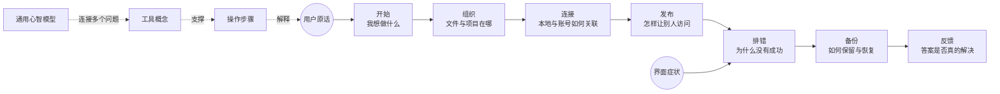
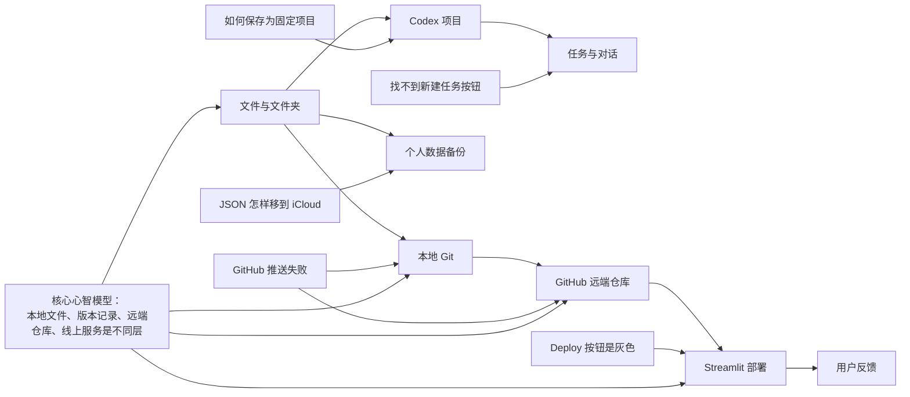

# 小白 AI 知识地图

## 这张图是什么

它不是一棵从第一章读到最后一章的课程树，也不是把所有问答随意连起来的点云。它是一张有方向的“地铁图”：

- 横向是用户完成一件事的操作旅程；
- 纵向是从表面问题走向稳定能力的知识深度；
- 每个真实问题是一个入口；
- 前置知识告诉用户为什么会卡住；
- 后续问题告诉项目下一步应该主动补什么。

## 整体形状



真正的知识地图会沿着两条轴生长，而不是从一个中心向外无限发散。这样既保留真实问题的入口，也不会变成难以阅读的“蜘蛛网”。

## 当前主干



从这张图可以看到，“GitHub 推送失败”并不是一个孤立故障。它背后连接着文件夹位置、本地 Git、远端仓库、权限和网络；如果用户没有分清这些层，解决一次后还会在部署阶段再次卡住。

## 节点分为五类

| 节点 | 作用 | 示例 |
| --- | --- | --- |
| 真实问题 | 用户进入地图的入口 | “Deploy 为什么是灰色？” |
| 操作步骤 | 当下可以照做的答案 | 填写仓库、分支和入口文件 |
| 工具概念 | 理解界面中的对象 | 仓库、分支、主文件 |
| 心智模型 | 可以迁移到其他工具的认识 | 本地、远端、线上服务是不同层 |
| 后续问题 | 解决后大概率出现的下一步 | 部署成功后如何更新版本 |

## 关系只有六种

- `requires`：先理解或完成什么；
- `explains`：哪个概念解释了问题；
- `next`：解决后最可能走向哪里；
- `same_root`：表象不同但根因相同；
- `verified_by`：由哪个案例或操作验证；
- `supersedes`：新版本替代了旧答案。

控制关系种类可以避免图越来越乱，也方便未来生成导航、学习路径或自动推荐。

## 我如何主动补全

当用户提出“为什么 Deploy 是灰色”时，项目不只产生一篇排错文章，还会检查：

```text
前置：什么是仓库、分支和入口文件？
  ↓
当前：为什么 Deploy 按钮是灰色？
  ↓
原理：GitHub 仓库与 Streamlit 线上应用是什么关系？
  ↓
后续：部署成功后，修改代码怎样更新线上版本？
```

如果其中一项缺失，就在数据文件中建立 `gap` 节点，并进入待验证问题池。完成实际验证后再发布为正式指南。

## 产品中的最终呈现

早期仍以 README 和单篇问答为主。知识地图首先服务于维护者选题，不要求用户学习整张图。

内容达到约 20—30 个已验证问题后，可以提供三种入口：

1. **按我现在的症状找答案**：直接搜索用户原话；
2. **告诉我下一步**：根据当前节点推荐一个后续问题；
3. **补齐我的基础**：沿 `requires` 关系回到最少的前置知识。

地图本身的数据维护在 [`data/knowledge-map.yml`](../data/knowledge-map.yml)，图示只是其中一个阅读视图。
